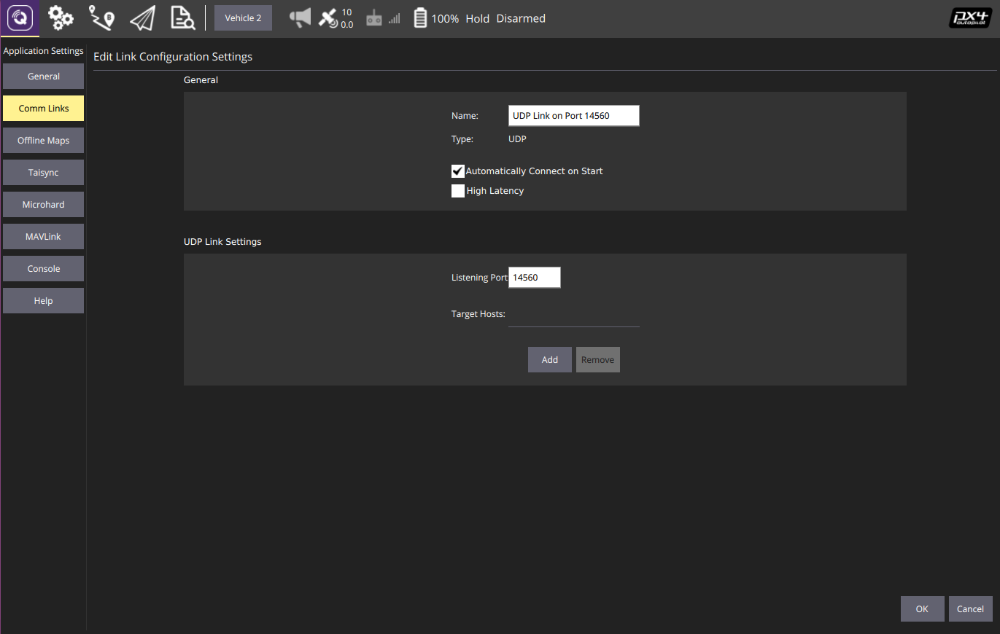
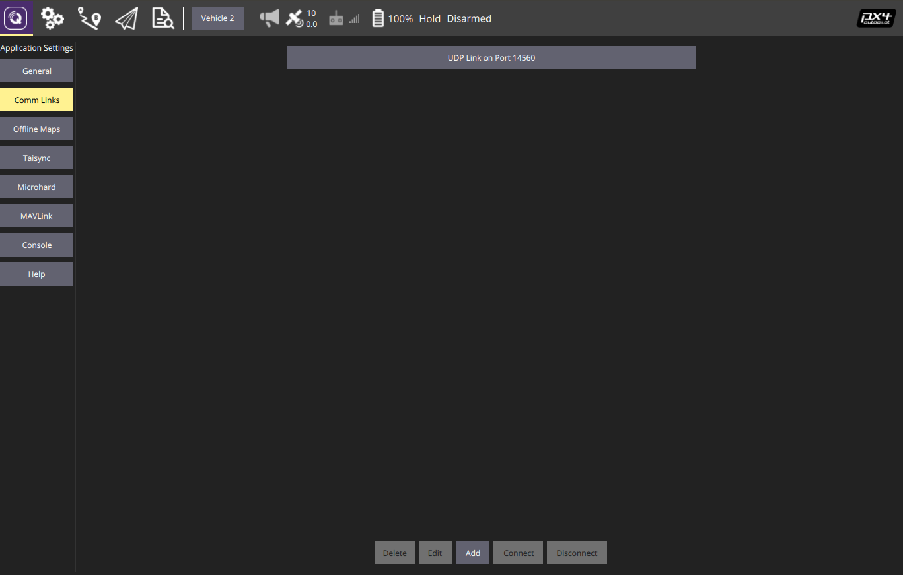

# Multi UAV

A ROS package for Multi UAV Simulation in Gazebo simulator.

## Features
- Provide 3D simulation using Gazebo, ROS, MAVROS and PX4 firmware;
- Include a ROS Node to control each UAV use simple MAVROS commands;
- The UAV model was set up with a camera;
- It is possible to visualize the UAV camera in RVIZ;

## Installation
Following the steps above you are able to perform a simple setup of a Multi UAV simulation.

### Install ROS
This tutorial explains the installation on Ubuntu 16.04 and ROS Kinetic version. For installation in other Linux distribution, you should change the ROS distribution following these tutorials [here](http://wiki.ros.org/Installation).

Run on terminal:
```sh
$ sudo sh -c 'echo "deb http://packages.ros.org/ros/ubuntu $(lsb_release -sc) main" > /etc/apt/sources.list.d/ros-latest.list'
$ sudo apt-key adv --keyserver 'hkp://keyserver.ubuntu.com:80' --recv-key C1CF6E31E6BADE8868B172B4F42ED6FBAB17C654
$ sudo apt update
$ sudo apt install ros-kinetic-desktop-full
$ sudo rosdep init
$ rosdep update
$ echo "source /opt/ros/kinetic/setup.bash" >> ~/.bashrc
$ source ~/.bashrc
$ sudo apt install python-rosinstall python-rosinstall-generator python-wstool build-essential
```

### Install additional ROS Packages:
Run on terminal:
```sh
$ sudo apt install ros-kinetic-mavlink*
$ sudo apt install ros-kinetic-mavros*
$ wget https://raw.githubusercontent.com/mavlink/mavros/master/mavros/scripts/install_geographiclib_datasets.sh
$ sudo chmod +x install_geographiclib_datasets.sh
$ sudo ./install_geographiclib_datasets.sh
```

### Create a ROS Workspace
Run on terminal:
```sh
$ mkdir -p ~/drone_simulator_ws/src
$ cd ~/drone_simulator_ws/
$ catkin_make
```

### Installing a Multi UAV Package
Run on terminal:
```sh
$ cd ~/drone_simulator_ws/src
$ git clone https://github.com/maikbasso/multi_uav.git
$ sudo sh ~/drone_simulator_ws/src/multi_uav/scripts/install/pc/install.sh
$ catkin_make
```
In the installation, the script can request your Linux user password.

## Running a simulation
Run on terminal:
```sh
$ cd ~/drone_simulator_ws/
$ source src/multi_uav/scripts/init/pc/init_ws.sh
$ roslaunch multi_uav multi_uav.launch
```

Optional parameters:

    - worldName: the name of the world in worlds folder;
    - modelType: xacro or sdf;
    - vehicle: iris or solo (only if using sdf model type);
    - numberUAVs: the number of drones (0 to N drones). N increases until your PC supports;

Example:
```sh
$ roslaunch multi_uav multi_uav.launch vehicle:=solo modelType:=sdf numberUAVs:=5 worldName:=empty
```

## Node examples
With the simulation running, run in a new terminal:
```sh
$ cd ~/drone_simulator_ws/
$ source src/multi_uav/scripts/init/pc/init_ws.sh
```
Then, run a example:
```sh
$ roslaunch multi_uav offboard_local_control.launch
	or
$ roslaunch multi_uav offboard_global_control.launch
```

## Configuring a Ground Station
- Run on terminal:

```sh
$ sh ~/drone_simulator_ws/src/multi_uav/scripts/run_qgroundcontrol.sh
```

- Click on QGroundControl Icon;
- Click on "Comm Links";
- Click in Add;
- Insert all informations following the image bellow:



- Click on OK;
- A connection link appears on "Comm Links" tab, as in the image below:



- Close and open a ground station again. If a simulation is running the ground station connects automatically in each UAV.

## Solving problems

### Solve SSL error on Ubuntu 18.04
Run on terminal:
```sh
$ sh ~/drone_simulator_ws/src/multi_uav/scripts/solve_ssl_error_ubuntu_18_04.sh
```

### Compiling on Raspberry Pi 3 B+ with Ubuntu 16.04
Firstly, you need to increase the virtual memory:
```sh
$ sudo fallocate -l 1G /swapfile
$ sudo chmod 600 /swapfile
$ sudo mkswap /swapfile
$ sudo swapon /swapfile
```
Now, install the additional ros packages:
```sh
$ sudo apt install ros-kinetic-gazebo-*
```
Then, compile the project:
```sh
$ cd catkin_ws
$ catkin_make
```
